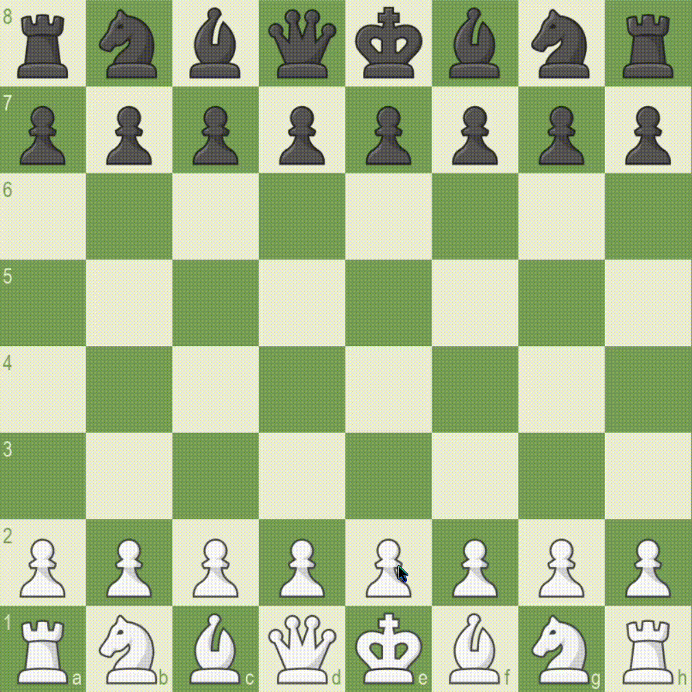

# Dự Án Cờ Vua Bằng Python

## 1. Giới Thiệu

Dự án này là một trò chơi cờ vua được phát triển bằng Python, với giao diện đồ họa thân thiện và đầy đủ các tính năng cơ bản của một ván cờ vua tiêu chuẩn. Người dùng có thể chơi với bạn bè hoặc thử thách với máy (negamaxAI).

<div align="center">
    
</div>

---

## 2. Cấu Trúc Dự Án

Dự án được tổ chức theo cấu trúc sau:

- **`images/`**: Thư mục chứa các tài nguyên hình ảnh quân cờ dưới định dạng PNG và ICO.
- **`sounds/`**: Thư mục chứa các tài nguyên âm thanh dưới định dạng MP3.
- **`videos/`**: Thư mục chứa các tài nguyên video dưới định dạng MP4.

### Các File Python

Dưới đây là danh sách các file Python trong dự án cùng với mô tả chức năng của chúng:

- **`negamaxAI.py`**: Thuật toán điều khiển AI (thuật toán Negamax).
- **`constants.py`**: Các hằng số sử dụng trong trò chơi.
- **`engine.py`**: Cung cấp các thư viện và chức năng cơ bản của trò chơi.
- **`system.py`**: Chứa các chức năng chính của trò chơi.
- **`interface.py`**: Định nghĩa giao diện người dùng cho trò chơi.
- **`additions.py`**: Các bổ sung và tiện ích cho giao diện người dùng.
- **`main.py`**: File khởi chạy chính của trò chơi.
- **`encryption.py`**: Trình mã hóa base64
- **`decryption.py`**: Trình giải mã base64
- **`images.py`**: Ảnh được mã hóa base64
- **`sounds.py`**: Âm thanh được mã hóa base64
- **`videos.py`**: Videos được mã hóa base64

---

## 3. Yêu Cầu Hệ Thống

Để phát triển và chạy trò chơi, bạn cần:

- **Khuyên dùng**: IDE PyCharm
- `Python`: 3.9.x hoặc cao hơn
- `Pygame`: 2.6.0 hoặc cao hơn

## 4. Hướng Dẫn Bắt Đầu

### 4.1. Clone Dự Án

Đầu tiên, bạn cần clone dự án về máy tính của mình:

```bash
git clone https://github.com/XDgamerVN/Chess_Python.git
cd Chess_Python
```

### 4.2. Tạo Môi Trường Ảo (Tuỳ Chọn)

Môi trường ảo giúp bạn quản lý các thư viện cho dự án mà không làm ảnh hưởng đến các dự án khác:

```bash 
python -m venv venv
source venv/bin/activate  # Trên Linux
venv\Scripts\activate   # Trên Windows
```

### 4.3. Cài Đặt Thư Viện

#### Ubuntu/Debian:

```bash
sudo apt update
sudo apt install python3 python3-pip
sudo apt install libsdl2-mixer-2.0-0 libjpeg-dev zlib1g-dev
```

#### Fedora:

```bash
sudo dnf install python3 python3-pip
sudo dnf install SDL2_mixer-devel libjpeg-devel zlib-devel
```

#### Arch Linux/Manjaro:

```bash
sudo pacman -S python python-pip
sudo pacman -S sdl2_mixer libjpeg-turbo zlib
```

#### OpenSUSE:

```bash
sudo zypper install python3 python3-pip
sudo zypper install SDL2_mixer-devel libjpeg8-devel zlib-devel
```

#### macOS:

- Cài đặt Homebrew nếu chưa có:

```bash
/bin/bash -c "$(curl -fsSL https://raw.githubusercontent.com/Homebrew/install/HEAD/install.sh)"
```

- Cài đặt các thư viện cần thiết:

```bash
brew install python
brew install sdl2 sdl2_mixer libjpeg zlib
```

#### Windows:

- Tải Python từ trang chính thức: [python.org](https://www.python.org/)
- Chạy trình cài đặt.
- Mở Command Prompt và kiểm tra phiên bản Python bằng lệnh:

#### kiểm tra phiên bản:

```bash
python --version
```

#### Thư viện bổ sung:

- Dự án yêu cầu một số thư viện Python bổ sung như `pygame`, `qrcode`, và `Pillow`. Bạn có thể cài đặt tất cả bằng lệnh:

```bash
pip install pygame 
```

### 4.4. Chạy Trò Chơi

Sau khi cài đặt xong, bạn có thể chạy trò chơi bằng lệnh sau:

```bash
python main.py
```

### 4.5. Thưởng Thức Trò Chơi

Bây gờ bạn có thể chơi cùng bạn bè hoặc thử thách với máy (negamaxAI)

### 4.6. Lưu ý:

- Việc mã hóa này có mục đích tạo chương trình độc lập và không cần phải có **`images/`** với **`sounds/`** ở cạnh.

---

## 5. Tính Năng Nổi Bật

- Chế độ đơn giản: Bạn có thể chơi cùng bạn thân hay thách thức với máy. 
- AI thông minh: Dựa trên thuật toán Negamax để đưa ra các nước đi hợp lý.
- Giao diện trực quan: Đơn giản và dễ sử dụng.
- Âm thanh sống động: Tăng trải nghiệm chơi game.

---

## 6. Kế Hoạch Tương Lai

Tôi dự định cập nhật dự án với những tính năng mới, bao gồm:

- Cải thiện thuật toán AI.
- Tính năng lưu trữ ván cờ.
- Nâng cấp giao diện.
- Tùy thỉnh giao diện quân cờ và bàn cờ.

---

## 7. Tài Liệu Tham Khảo

Xin cảm ơn LeMaster Tech và Eddie Sharick (Eddie) về kiến thức phát triển dự án này.
- [LeMaster Tech](https://www.youtube.com/@lemastertech)
- [Eddie Sharick (Eddie)](https://www.youtube.com/@eddiesharick6649)

---

## 8. Liên Hệ

Nếu bạn có bất kỳ câu hỏi hoặc phản hồi nào, hãy liên hệ với chúng tôi qua địa chỉ email: [dungnguyen2661@gmail.com]

---

**_Cảm ơn bạn đã quan tâm đến dự án của tôi. Chúc bạn có những giờ phút chơi game vui vẻ!_**
